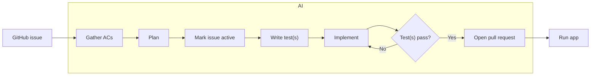
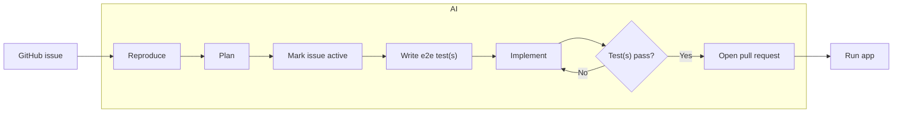
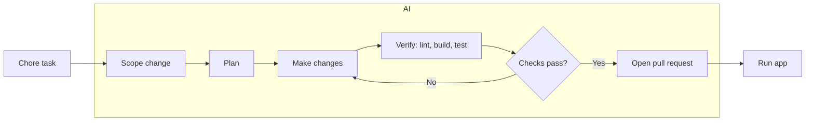
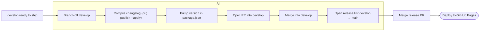
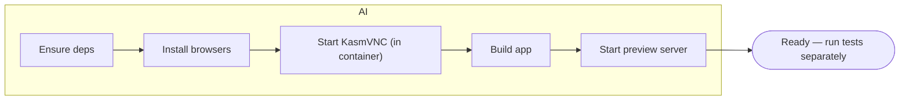
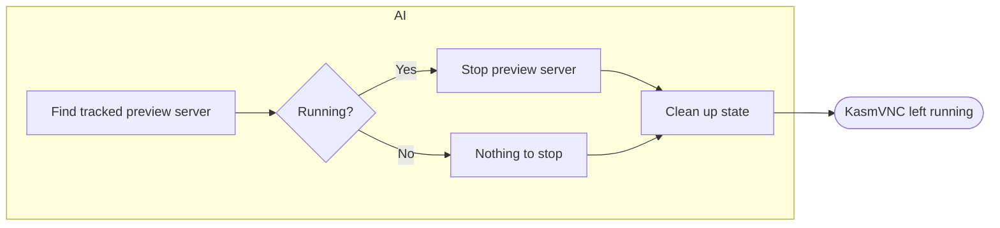

# Development Workflows

All workflows use git worktrees to make changes to source code and do not make changes to source code in the root repository.

## Methodology (Scrum)

These workflows are **Scrum-informed**. Work starts from an ordered backlog
(GitHub issues), lands as small reviewable Increments (PRs into `develop`), and
must meet a shared **Definition of Done** before a PR opens. Each workflow below
maps onto a Scrum event or artifact:

| Scrum | Here |
| --- | --- |
| Product Backlog / Product Goal | GitHub issues, ordered; the pomo product vision |
| Sprint Planning (Why/What/How) | the **Plan** step + confirmation gate in each workflow |
| Increment + Definition of Done | a PR into `develop` that passes tests, lint, and build |
| Sprint Review | opening the PR + **running the app** for live review |
| Sprint (cadence) → production | integration on `develop`; **Release** ships `develop → main` |
| Product Owner / Developers / Scrum Master | the human / the agentic layer / the enforced guardrails |

The agentic layer carries the full methodology — the Scrum→factory mapping, the
five values as agent behavior, and the canonical **Definition of Done** — in
[`.claude/docs/scrum-methodology.md`](.claude/docs/scrum-methodology.md).
Skills consult it when a workflow decision isn't spelled out below.

## Implement Feature (issue → PR)

## Bugfix (issue → PR)

## Chore (maintenance → PR)

Non-feature, non-bugfix upkeep — dependency bumps, config, docs, refactors,
tooling. There's no acceptance criteria or bug to reproduce, so the focus is on
scoping the change and verifying it doesn't regress the build.

## Release (develop → main)

When `develop` is ready to ship. Change files are created per development PR
(`npx ccg change`) but are **not** published then — `ccg publish` runs only
here, at release, so all changes since the last release land in the changelog
together. See the README for the release diagram.

## Start E2E (set up, don't run)

Prepares the Playwright e2e environment so the suite can run immediately — it
does **not** run any specs.

## Stop E2E (tear down)

Stops the preview server that Start E2E launched and cleans up its state,
leaving the KasmVNC display running.

