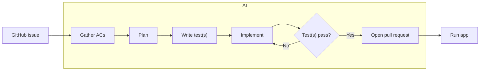
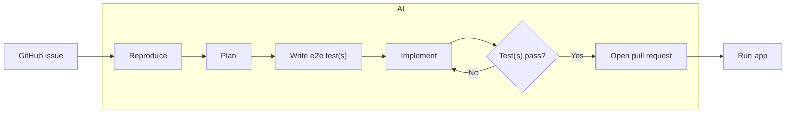

# Development Workflows

All workflows use git worktrees to make changes to source code and do not make changes to source code in the root repository.

## Branching model

`develop` is the default/integration branch; `main` is the production branch.
Every issue → PR workflow below branches off `develop` and opens its PR **into
`develop`**. Shipping to production is a separate **release PR from `develop` →
`main`** (see [Release](#release-develop--main)). Both branches are protected:
no direct pushes, no force-push or deletion, enforced for admins — all changes
go through a pull request. See the README for the branch-structure and release
diagrams.

## Implement Feature (issue → PR)

## Bugfix (issue → PR)

## Release (develop → main)

When `develop` is ready to ship:

1. **Compile the changelog.** On a branch off `develop`, run
   `npx ccg publish --apply` to fold every change file accumulated on `develop`
   into `CHANGELOG.md` and bump the version in `package.json`. Commit the result
   and merge it into `develop` via PR (both branches are protected — no direct
   pushes).
2. **Open the release PR** from `develop` into `main` and merge it. Merging
   advances `main`, which triggers the deploy workflow and publishes to GitHub
   Pages.

Change files are created per development PR (`npx ccg change`) but are **not**
published then — `ccg publish` runs only here, at release, so all changes since
the last release land in the changelog together. See the README for the release
diagram.

## Start E2E (set up, don't run)

Prepares the Playwright e2e environment so the suite can run immediately — it
does **not** run any specs.

## Stop E2E (tear down)

Stops the preview server that Start E2E launched and cleans up its state,
leaving the KasmVNC display running.

