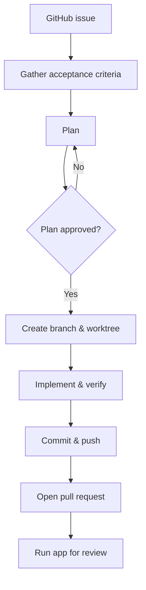

# Development Workflows

## Implement Feature (issue → PR)

```mermaid
flowchart TD
    A[GitHub issue] --> B[Gather acceptance criteria]
    B --> C[Plan]
    C --> D{Plan approved?}
    D -->|No| C
    D -->|Yes| E[Create branch & worktree]
    E --> F[Implement & verify]
    F --> G[Commit & push]
    G --> H[Open pull request]
    H --> I[Run app for review]
```
