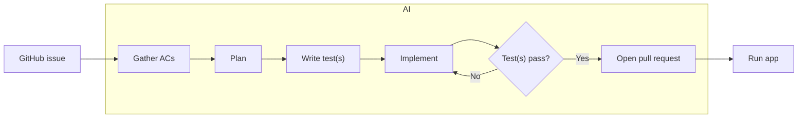
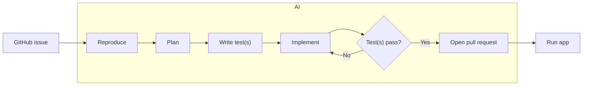

# Development Workflows

## Implement Feature (issue → PR)

```mermaid
flowchart LR
    A[GitHub issue] --> B[Gather ACs]
    subgraph AI
        B[Gather ACs] --> C[Plan]
        C --> D["Write test(s)"]
        D --> F[Implement]
        F --> V{"Test(s) pass?"}
        V -->|No| F
        V -->|Yes| H[Open pull request]
    end
    H --> I[Run app]
```

## Bugfix (issue → PR)

```mermaid
flowchart LR
    A[GitHub issue] --> B[Reproduce]
    subgraph AI
        B[Reproduce] --> C[Plan]
        C --> D["Write test(s)"]
        D --> E[Implement]
        E --> F{"Test(s) pass?"}
        F -->|No| E
        F -->|Yes| G[Open pull request]
    end
    G --> H[Run app]
```
