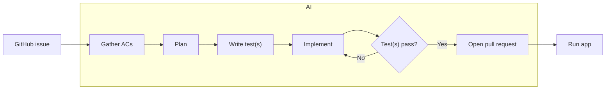
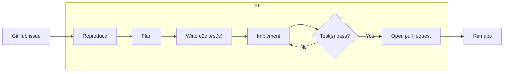

# Development Workflows

All workflows use git worktrees to make changes to source code and do not make changes to source code in the root repository.

## Implement Feature (issue → PR)

## Bugfix (issue → PR)

## Start E2E (set up, don't run)

Prepares the Playwright e2e environment so the suite can run immediately — it
does **not** run any specs.

## Stop E2E (tear down)

Stops the preview server that Start E2E launched and cleans up its state,
leaving the KasmVNC display running.

