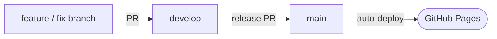

# Pomo

React + TypeScript + Vite Progressive Web App scaffold (Sass styling).

## Scripts

- `npm run dev` - start dev server with PWA dev options
- `npm run build` - type check and production build
- `npm run preview` - locally preview the production build

## PWA

`vite-plugin-pwa` is configured with `autoUpdate` and basic manifest.

## Notes

- Strict TypeScript enabled.
- React 19 with automatic JSX runtime.
- Sass (`style.scss`) with variables & nesting.
- Adjust manifest in `vite.config.ts` as needed.

## Branching model

Two long-lived branches:

- **`develop`** — the default/integration branch. All day-to-day development
  lands here: create a feature/fix branch, then open a PR **into `develop`**.
- **`main`** — the production branch. It only receives changes via a **release
  PR from `develop` → `main`**, and a push to `main` is what deploys to
  production.



Both branches are protected: direct pushes are blocked (all changes go through a
pull request), force-pushes and deletion are disabled, and the rules apply to
admins too. Approvals are not required, so you can merge your own PRs.

## Deployment

Hosted via GitHub Pages (project site): <https://ethan-mfb.github.io/pomo/>

Production deploys happen automatically on pushes to `main` (or via a manual
**Run workflow**), driven by [`.github/workflows/deploy.yml`](.github/workflows/deploy.yml).
Under the branching model above, `main` only advances via a release PR from
`develop`, so **merging that release PR is what ships to production**. The
workflow uses the modern Pages-via-Actions flow — publishing a build artifact —
rather than a `gh-pages` branch.

### How it works

1. **Trigger** — a push to `main` (or `workflow_dispatch`). A `pages` concurrency group with `cancel-in-progress` means a newer push cancels any in-flight deploy.
2. **`build` job** — checks out the repo, sets up Node 20 with npm caching, runs `npm ci` then `npm run build`. Because `build` is `tsc -b && vite build`, a type error fails the deploy. The resulting `dist/` is uploaded via `actions/upload-pages-artifact`.
3. **`deploy` job** — depends on `build` and publishes the artifact to the `github-pages` environment with `actions/deploy-pages`.

Because the site is served from the `/pomo/` subpath, `base: '/pomo/'` in `vite.config.ts` makes Vite emit asset URLs relative to that base (also why `useAlarm` loads `'alarm.mp3'` and the PWA `scope`/`start_url` are `/pomo/`).

> **Note:** this deploy workflow is independent of CI. The test suite runs in a separate workflow (`.github/workflows/ci.yml`); `deploy.yml` does not depend on it, so a push to `main` deploys without gating on tests passing.

### Status


### Installing the PWA

1. Visit the URL above.
2. Use the browser’s install/Add to Home Screen option.
3. Launch the installed app; updates are pulled automatically (service worker `autoUpdate`).

## Changelog & Release Workflow

This project uses `@mfbtech/changelog-generator` to manage change files and generate the `CHANGELOG.md`.

### Developer Flow

1. Create a feature/fix branch off `develop`.
2. Implement changes and commit.
3. Run `npx ccg change` next to `package.json`.
   - Follow prompts to describe the change and select a version bump (major/minor/patch/none).
4. Commit the generated change file (stored under a `.change` directory created by the tool).
5. Open a PR into `develop` and merge. Do **not** run `ccg publish` here — change files accumulate on `develop` and are compiled into the changelog at release time (see [Releasing](#releasing-develop--main)).

### CI Verification (optional)

Run `npx ccg change --verify` in CI to ensure a change file exists for modified code.

### Releasing (develop → main)

A release compiles every change file accumulated on `develop` into
`CHANGELOG.md`, bumps the version, and ships `main`:

1. On a branch off `develop`, compile the changelog and bump `package.json`:

   ```bash
   npx ccg publish --apply
   ```

   Commit the result and merge it into `develop` via PR (both branches are
   protected, so it can't be pushed directly). For a dry run first (no file
   modifications), use `npx ccg publish`.
2. Open the release PR from `develop` → `main` and merge it. Merging advances
   `main`, which triggers the deploy workflow and publishes to GitHub Pages.

### Additional Notes (Changelog System)

- Default comparison branch is `develop` (configured in `.changelog-generator.json`), matching the integration branch where development PRs land.
- If you accidentally pick the wrong bump type, edit or delete the specific change file before publishing.
- Empty or trivial changes can use bump `none`; they will appear without version impact.
